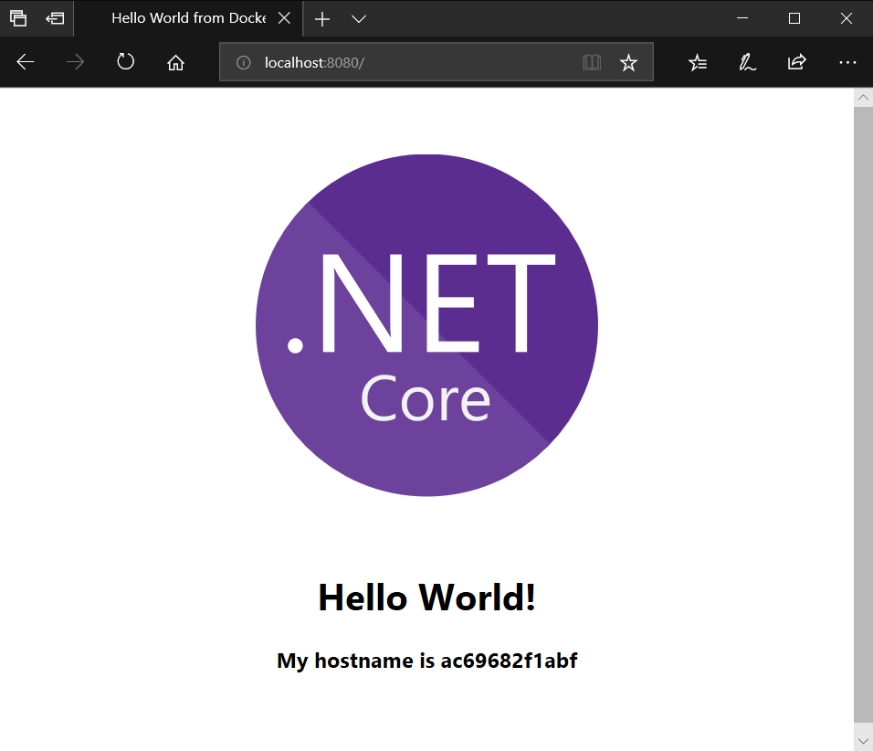

# Azure Container Registry (ACR) - managed Docker private registry

---

## Overview
Azure Container Registry is a managed [Docker registry](https://docs.docker.com/registry/) service based on the open-source Docker Registry 2.0. Create and maintain Azure container registries to store and manage your private [Docker container](https://www.docker.com/what-docker) images.

You start your learning journey form Docker registry because every service that uses Docker container uses Docker registry at the end.

### Objectives
In this hands-on lab, you will learn how to:
* Create an Azure Container Registry
* Authenticate with Azure Container Registry using Service Principal
* Push and pull Docker container images to Azure Container Registry
* Remove images from Azure Container Registry

## Exercises
This hands-on lab includes the following tasks:
* [Exercise 1: Create an Azure Container Registry](#exercise1)
* [Exercise 2: Authenticate with Azure Container Registry using Service Principal](#exercise2)
* [Exercise 3: Push and pull Docker container images to Azure Container Registry](#exercise3)
* [Exercise 4: Remove images from Azure Container Registry](#exercise4)

Estimated time to complete this lab: **20** minutes.

### Exercise 1: Create an Azure Container Registry
Azure Container Registry is a managed Docker container registry service used for storing private Docker container images. These exercise details show how to create an Azure Container Registry instance using the Azure CLI.

#### Task 1: Set bash variables for your environment
* The **resourceGroupName** is the name of your Resource Group.
* The **location** is the location of your Resource Group.
* The **containerRegistryName** is the name of your Azure Container Registry.
```bash
resourceGroupName=<resource-group-name>
location=<location>
containerRegistryName=<container-registry-name>
```

#### Task 2: Create a Resource Group
An Azure resource group is a logical container into which Azure resources are deployed and managed.
```bash
az group create --name $resourceGroupName --location $location
```

#### Task 3: Create an Azure Container Registry
In this hands-on lab, you create a **Basic** registry. Azure Container Registry is available in several different SKUs. For extended details on each, see [Container registry SKUs](https://docs.microsoft.com/en-us/azure/container-registry/container-registry-skus).
```bash
az acr create --resource-group $resourceGroupName --name $containerRegistryName --sku Basic
```

[Scroll to Top](#exercises)

### Exercise 2: Authenticate with Azure Container Registry using Service Principal
There are [several ways to authenticate](https://docs.microsoft.com/en-us/azure/container-registry/container-registry-authentication) with an Azure Container Registry, each of which applies to one or more registry usage scenarios.

You can log in to a registry directly via [individual login](https://docs.microsoft.com/en-us/azure/container-registry/container-registry-authentication#individual-login-with-azure-ad), and your applications and container orchestrators can perform unattended, or "headless," authentication by using an Azure Active Directory (Azure AD) [service principal](https://docs.microsoft.com/en-us/azure/container-registry/container-registry-authentication#service-principal).

For more information on using a service principal for headless authentication to ACR, see [Azure Container Registry authentication with service principals](https://docs.microsoft.com/en-us/azure/container-registry/container-registry-auth-service-principal).

> **Note**
>
> Service Principal authentication is highly recommended for production use. In this hands-on lab, you create and use Service Principal for ACR authentication.

#### Task 1: Set bash variables for your environment
* The **containerRegistryName** is the name of your Azure Container Registry.
* The **servicePrincipalName** can be any unique name within your subscription (you can use the default below).
* The **servicePrincipalRole** is default permission for Docker push and pull access (you can use the default below).
    * **reader** - pull only
    * **contributor** - push and pull
    * **owner** - push, pull, and assign roles
```bash
containerRegistryName=<container-registry-name>
servicePrincipalName=AcrServicePrincipal
servicePrincipalRole=contributor
```

#### Task 2: Obtain the full registry ID for subsequent command args
```bash
containerRegistryId=$(az acr show --name $containerRegistryName --query id --output tsv)
```

#### Task 3: Create a Service Principal and assign results to variables
```bash
servicePrincipalPassword=$(az ad sp create-for-rbac --name $servicePrincipalName --scopes $containerRegistryId --role $servicePrincipalRole --query password --output tsv)
servicePrincipalAppId=$(az ad sp show --id http://$servicePrincipalName --query appId --output tsv)
```

#### Task 4: Output the service principal's credentials
Use these in your services and applications to authenticate to the container registry.
```bash
echo "Service Principal AppID: $servicePrincipalAppId"
echo "Service Principal Password: $servicePrincipalPassword"
```

#### Task 5: Log in to a registry
The recommended method when working in a command line is with the Azure CLI command [az acr login](https://docs.microsoft.com/en-us/cli/azure/acr#az_acr_login).
```bash
az acr login --name $containerRegistryName --username $servicePrincipalAppId --password $servicePrincipalPassword
```

You can also log in with [docker login](https://docs.docker.com/engine/reference/commandline/login/).
```bash
docker login $containerRegistryName.azurecr.io -u $servicePrincipalAppId -p $servicePrincipalPassword
```

> **Note**
>
> Always specify the fully qualified registry name (all lowercase) when you use **docker login** and when you tag images for pushing to your registry. In the examples in this article, the fully qualified name is *myregistry.azurecr.io*.

[Scroll to Top](#exercises)

### Exercise 3: Push and pull Docker container images to Azure Container Registry
An Azure Container Registry stores and manages private [Docker container images, similar to the way [Docker Hub](http://hub.docker.com/) stores public Docker images. You can use the [Docker command-line interface](https://docs.docker.com/engine/reference/commandline/cli/) (Docker CLI) for [push](https://docs.docker.com/engine/reference/commandline/push/), [pull](https://docs.docker.com/engine/reference/commandline/pull/), and other operations on your container registry.

#### Task 1: Set bash variables for your environment
* The **containerRegistryFullName** is the full name (with .azurecr.io) of your Azure Container Registry.
* The **containerImageName** is the name of Docker container image (you can use the default below).
```bash
containerRegistryFullName=<container-registry-full-name>
containerImageName=dariuszporowski/hello-world
```

#### Task 2: Pull a image from Docker Hub
First, pull the public [hello-world](https://hub.docker.com/r/dariuszporowski/hello-world/) image to your local computer.
```bash
docker pull $containerImageName
```

#### Task 3: Run the container locally
Execute following [docker run](https://docs.docker.com/engine/reference/run/) command to start a local instance of the **hello-world** container interactively (**-it**) on port 8080. The **--rm** argument specifies that the container should be removed when you stop it.
```bash
docker run -it --rm -p 8080:80 $containerImageName
```

Browse to [http://localhost:8080](http://localhost:8080) to view the web page with container hostname served by **hello-world** in the running container. You should see a page similar to the following:



Because you started the container interactively with **-it**, you can see the container's output on the command line after navigating to it in your browser.
To stop and remove the container, press `Ctrl+C`.

#### Task 4: Create a tag of the image
Use [docker tag](https://docs.docker.com/engine/reference/commandline/tag/) to create an alias of the image with the fully qualified path to your registry.
```bash
docker tag $containerImageName $containerRegistryFullName/$containerImageName
```

> **Note**
>
> For more information about tagging with namespaces, see the [Repository namespaces](https://docs.microsoft.com/en-us/azure/container-registry/container-registry-best-practices#repository-namespaces) section of [Best practices for Azure Container Registry](https://docs.microsoft.com/en-us/azure/container-registry/container-registry-best-practices).

#### Task 5: Push the image to your registry
Now that you've tagged the image with the fully qualified path to your private registry, you can push it to the registry with [docker push](https://docs.docker.com/engine/reference/commandline/push/).
```bash
docker push $containerRegistryFullName/$containerImageName
```

#### Task 6: Pull the image from your registry
Use the [docker pull](https://docs.docker.com/engine/reference/commandline/pull/) command to pull the image from your registry.
```bash
docker pull $containerRegistryFullName/$containerImageName
```

#### Task 7: Start the container
Use the [docker run](https://docs.docker.com/engine/reference/run/) command to run the image you've pulled from your registry.
```bash
docker run -it --rm -p 8080:80 $containerRegistryFullName/$containerImageName
```

Browse to [http://localhost:8080](http://localhost:8080) to view the running container.

To stop and remove the container, press `Ctrl+C`.

[Scroll to Top](#exercises)

### Exercise 4: Remove images from Azure Container Registry
If you no longer need the container image, you can delete it from local machine and Docker registry as well.

#### Task 1: Set bash variables for your environment
* The **containerRegistryName** is the name (without .azurecr.io) of your Azure Container Registry.
* The **containerImageName** is the name of Docker container image (you can use the default below).
```bash
containerRegistryName=<container-registry-name>
containerImageName=dariuszporowski/hello-world
```

#### Task 2: Remove the image from local machine
To remove images from your local machine, you can use [docker rmi](https://docs.docker.com/engine/reference/commandline/rmi/) command.
```bash
docker rmi $containerRegistryName.azurecr.io/$containerImageName
```

#### Task 3: Remove the image from Azure Container Registry
To remove images from your Azure Container Registry, you can use the Azure CLI command [az acr repository delete](https://docs.microsoft.com/en-us/cli/azure/acr/repository#az_acr_repository_delete).
```bash
az acr repository delete --name $containerRegistryName --repository $containerImageName --yes
```

#### Task 4: Repeat steps 4-5 from Exercise 3
You will use this container image on next exercises.

[Scroll to Top](#exercises)

## Summary
In this hands-on lab you learned how to:
* Create an Azure Container Registry
* Authenticate with Azure Container Registry using Service Principal
* Push and pull Docker container images to Azure Container Registry
* Remove images from Azure Container Registry

## References
To learn more, follow below references.
* [Azure Container Registry product page](https://azure.microsoft.com/en-us/services/container-registry/)
* [Azure Container Registry documentation](https://docs.microsoft.com/en-us/azure/container-registry/)