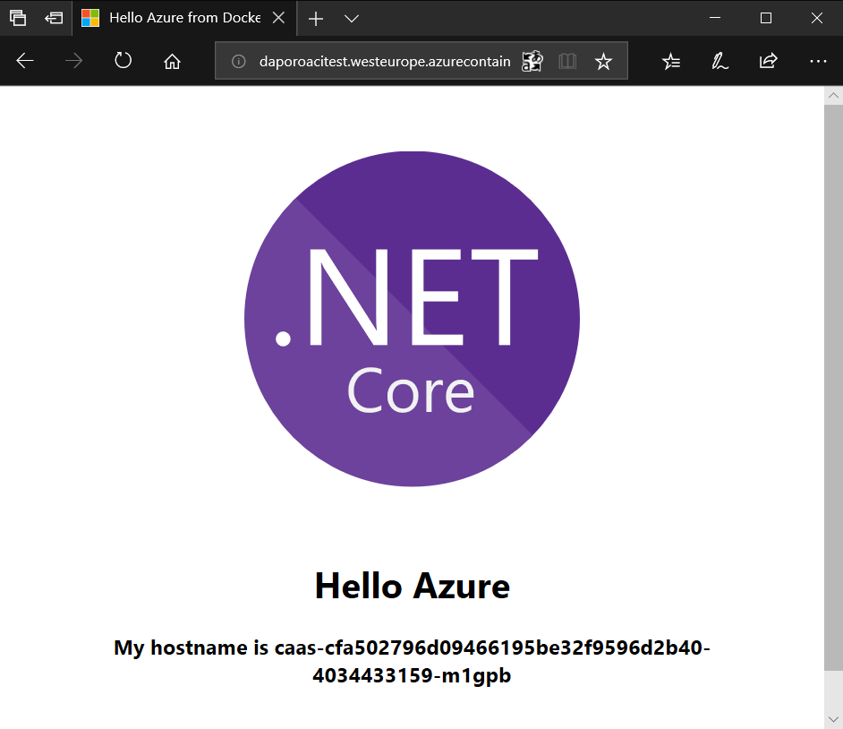

# Azure Container Instances (ACI) - easily run containers without managing servers

---

## Overview
Containers are becoming the preferred way to package, deploy, and manage cloud applications. Azure Container Instances offers the fastest and simplest way to run a container in Azure, without having to manage any virtual machines and without having to adopt a higher-level service.

Azure Container Instances is a great solution for any scenario that can operate in isolated containers, including simple applications, task automation, and build jobs. 

### Objectives
In this hands-on lab, you will learn how to:
* Create a container in Azure Container Instances
* Troubleshooting issues with a container in Azure Container Instances
* Remove containers from Azure Container Instances

### Prerequisites
The following are required to complete this hands-on lab:
* Finished hands-on lab with Azure Container Registry (ACR)

## Exercises
This hands-on lab includes the following exercises:
* [Exercise 1: Create a container in Azure Container Instances](#exercise1)
* [Exercise 2: Troubleshooting issues with a container in Azure Container Instances](#exercise2)
* [Exercise 3: Remove containers from Azure Container Instances](#exercise3)

Estimated time to complete this lab: **15** minutes.

### Exercise 1: Create a container in Azure Container Instances
Now you create a container in Azure and expose it to the Internet with a fully qualified domain name (FQDN) and custom environment variables.

#### Task 1: Set bash variables for your environment
* The **resourceGroupName** is the name of your Resource Group.
* The **location** is the location of your Resource Group.
* The **containerRegistryFullName** is the full name (with .azurecr.io) of your Azure Container Registry.
* The **containerImageName** is the name of Docker container image name (you can use the default below).
* The **containerName** is the name of ACI container name (you can use the default below).
* The **servicePrincipalAppId** is the Service Principal App ID.
* The **servicePrincipalPassword** is the Service Principal password.
* The **dnsNameLabel** is the prefix for FQDN. Must be unique within the Azure region you create the container instance.
```bash
resourceGroupName=<resource-group-name>
location=<location>
containerRegistryFullName=<azure-container-registry-name>.azurecr.io
containerImageName=dariuszporowski/hello-world
containerName=hello-world
servicePrincipalAppId=<service-principal-app-id>
servicePrincipalPassword=<service-principal-password>
dnsNameLabel=<dns-name-label>
```

#### Task 2: Create a Resource Group
Azure Container Instances, like all Azure resources, must be placed in a resource group, a logical collection into which Azure resources are deployed and managed.
```bash
az group create --name $resourceGroupName --location $location
```

#### Task 3: Deploy a Container
You can create a container by providing a name, a Docker image, and an Azure resource group to the [az container create](https://docs.microsoft.com/en-us/cli/azure/container#az_container_create) command.
```bash
az container create --resource-group $resourceGroupName --name $containerName --image $containerRegistryFullName/$containerImageName --registry-login-server $containerRegistryFullName --registry-username $servicePrincipalAppId --registry-password $servicePrincipalPassword --dns-name-label $dnsNameLabel --ports 80 --environment-variables NAME=ACI
```

#### Task 4: Verify deployment progress
To view the state of the deployment, use [az container show](https://docs.microsoft.com/en-us/cli/azure/container#az_container_show).
```bash
az container show --resource-group $resourceGroupName --name $containerName --query "{FQDN:ipAddress.fqdn,ProvisioningState:provisioningState,InstanceViewState:instanceView.state}" --out table
```

When the container is *Running*, use your web browser and go to FQDN shown above to view the web page with container hostname served by **hello-world** in the running container. You should see a page similar to the following:



[Scroll to Top](#exercises)

### Exercise 2: Troubleshooting issues with a container in Azure Container Instances
Viewing the logs for a container instance is helpful when troubleshooting issues with your container or the application it runs.

#### Task 1: Set bash variables for your environment
* The **resourceGroupName** is the name of your Resource Group.
* The **containerName** is the name of ACI container name (you can use the default below).
```bash
resourceGroupName=<resource-group-name>
containerName=hello-world
```

#### Task 2: Pull the container logs
Pull the container's logs with the [az container logs](https://docs.microsoft.com/en-us/cli/azure/container#az_container_logs) command.
```bash
az container logs --resource-group $resourceGroupName --name $containerName
```

#### Task 3: Attach output streams
In addition to tailing the logs, you can attach your local standard out and standard error streams to that of the container with the [az container attach ](https://docs.microsoft.com/en-us/cli/azure/container#az_container_attach) command.
```bash
az container attach --resource-group $resourceGroupName --name $containerName
```

[Scroll to Top](#exercises)

### Exercise 3: Remove containers from Azure Container Instances
When you're done with the container, remove it.

#### Task 1: Set bash variables for your environment
* The **resourceGroupName** is the name of your Resource Group.
* The **containerName** is the name of ACI container name (you can use the default below).
```bash
resourceGroupName=<resource-group-name>
containerName=hello-world
```

#### Task 3: Remove container
Use the [az container delete](https://docs.microsoft.com/en-us/cli/azure/container#az_container_delete) command to remove the container.
```bash
az container delete --resource-group $resourceGroupName --name $containerName --yes
```

#### Task 3: Verify deletion
To verify that the container has been deleted, execute the [az container list](https://docs.microsoft.com/en-us/cli/azure/container#az_container_list) command.
```bash
az container list --resource-group $resourceGroupName --output table
```

#### Task 4: Remove the Resource Group
Use the [az group delete](https://docs.microsoft.com/en-us/cli/azure/group#az-group-delete) command to remove the Resource Group.
```bash
az group delete --resource-group $resourceGroupName --yes --no-wait
```

[Scroll to Top](#exercises)

## Summary
In this hands-on lab you learned how to:
* Create a container in Azure Container Instances
* Troubleshooting issues with a container in Azure Container Instances
* Remove containers from Azure Container Instances

## References
To learn more, follow below references.
* [Azure Container Instances product page](https://azure.microsoft.com/en-us/services/container-instances/)
* [Azure Container Instances documentation](https://docs.microsoft.com/en-us/azure/container-instances/)