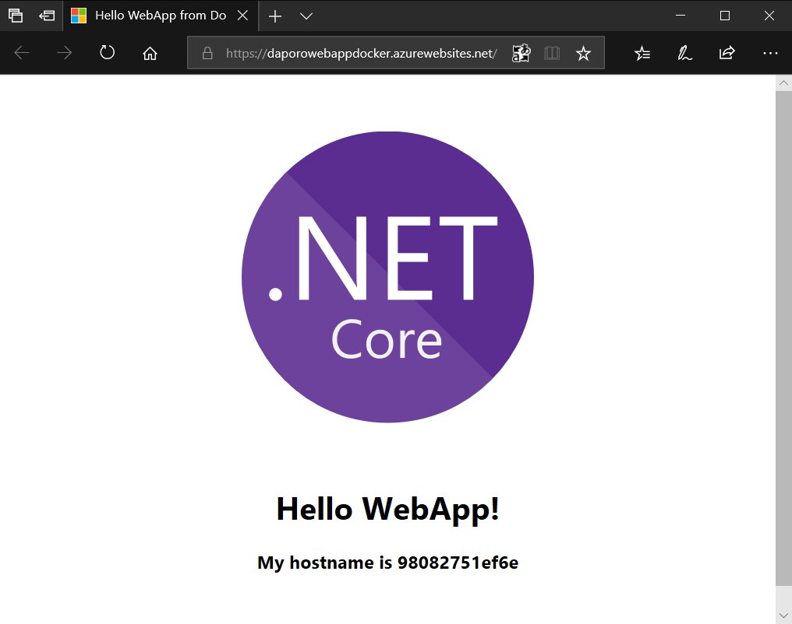
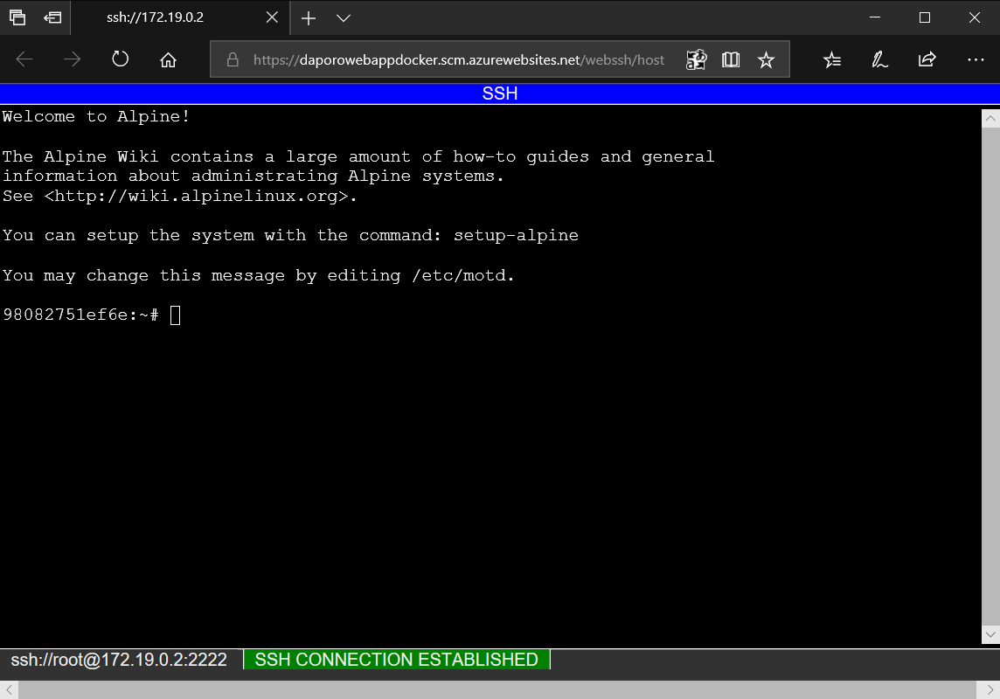

# Web App for Containers - easily deploy and run containerized web apps

---

## Overview
Web App for Containers is a fully managed compute platform that is optimized for hosting websites and web applications. You can use App Service on Linux to host web apps natively on Linux using [custom Docker images](https://docs.microsoft.com/en-us/azure/app-service/containers/tutorial-custom-docker-image).

### Objectives
In this hands-on lab, you will learn how to:
* Create Web App for Containers on App Service on Linux
* Connect to Web App for Containers using SSH
* Remove Web App for Containers on App Service on Linux

### Prerequisites
The following are required to complete this hands-on lab:
* Finished hands-on lab with Azure Container Registry (ACR)

## Exercises
This hands-on lab includes the following exercises:
* [Exercise 1: Create Web App for Containers on App Service on Linux](#exercise1)
* [Exercise 2: Connect to Web App for Containers using SSH](#exercise2)
* [Exercise 3: Remove Web App for Containers on App Service on Linux](#exercise3)

Estimated time to complete this lab: **30** minutes.

### Exercise 1: Create Web App for Containers on App Service on Linux
Now you create Web App for Containers on App Service on Linux using [Azure CLI](https://docs.microsoft.com/cli/azure/get-started-with-azure-cli).

#### Task 1: Set bash variables for your environment
* The **resourceGroupName** is the name of your Resource Group.
* The **location** is the location of your Resource Group.
* The **appSvcPlanName** is the name of your App Service plan.
* The **webAppName**  is the name of your Web App.
* The **containerRegistryFullName** is the full name (with .azurecr.io) of your Azure Container Registry.
* The **containerImageName** is the name of Docker container image name (you can use the default below).
* The **servicePrincipalAppId** is the Service Principal App ID.
* The **servicePrincipalPassword** is the Service Principal password.
```bash
resourceGroupName=<resource-group-name>
location=<location>
appSvcPlanName=<app-service-plan-name>
webAppName=<web-app-name>
containerRegistryFullName=<azure-container-registry-name>.azurecr.io
containerImageName=dariuszporowski/hello-world
servicePrincipalAppId=<service-principal-app-id>
servicePrincipalPassword=<service-principal-password>
```

#### Task 2: Create a Resource Group
A [resource group](https://docs.microsoft.com/en-us/azure/azure-resource-manager/resource-group-overview#terminology) is a logical container into which Azure resources like web apps, databases, storage accounts, and more are deployed and managed.
```bash
az group create --name $resourceGroupName --location $location
```

#### Task 3: Create an App Service plan
In App Service, an app runs in an *App Service plan*. An App Service plan defines a set of compute resources for a web app to run. These computing resources are analogous to the [server farm](https://wikipedia.org/wiki/Server_farm) in conventional web hosting. One or more apps can be configured to run on the same computing resources (or in the same App Service plan).
```bash
az appservice plan create --name $appSvcPlanName --resource-group $resourceGroupName --sku B1 --is-linux
```

#### Task 4: Create a Web App
*Azure App Service Web App* (or just Web App) is a service for hosting web applications, REST APIs, and mobile back ends.
```bash
az webapp create --resource-group $resourceGroupName --plan $appSvcPlanName --name $webAppName --runtime "dotnetcore|2.0"
```

#### Task 5: Use a Docker image from a private registry
In this section, you learn how to use a Docker image from a private registry in Web App for Containers, and it uses Azure Container Registry as an example. The steps for using other private registries are similar.
```bash
az webapp config container set --name $webAppName --resource-group $resourceGroupName --docker-custom-image-name $containerRegistryFullName/$containerImageName --docker-registry-server-url https://$containerRegistryFullName --docker-registry-server-user $servicePrincipalAppId --docker-registry-server-password $servicePrincipalPassword
```

#### Task 6: Set custom environment variables for the Web App
To set environment variables you can use [az webapp config appsettings set](https://docs.microsoft.com/en-us/cli/azure/webapp/config/appsettings#az-webapp-config-appsettings-set) command.
```bash
az webapp config appsettings set --name $webAppName --resource-group $resourceGroupName --settings NAME=WebApp
```

#### Task 7: Restart the Web App
Restart the Web App to apply latest settings.
```bash
az webapp restart --name $webAppName --resource-group $resourceGroupName
```

#### Task 8: Browse to the Web App
To view the default FQDN of the web app, use [az webapp show](https://docs.microsoft.com/en-us/cli/azure/webapp#az-webapp-show).
```bash
az webapp show --resource-group $resourceGroupName --name $webAppName --query "{FQDN:defaultHostName}" --out table
```

Use your web browser and go to FQDN shown above to view the web page with container hostname served by **hello-world** in the running container. You should see a page similar to the following:



You can open a web browser with your web app directly from Azure CLI as well using [az webapp browse](https://docs.microsoft.com/en-us/cli/azure/webapp#az-webapp-browse) command.
```bash
az webapp browse --resource-group $resourceGroupName --name $webAppName
```

[Scroll to Top](#exercises)

### Exercise 2: Connect to Web App for Containers using SSH
SSH enables secure communication between a container and a client. Sometimes is very helpful for troubleshooting. For a custom Docker image to support SSH, you must build it into a Dockerfile. So, you can follow [these instructions](https://docs.microsoft.com/en-us/azure/app-service/containers/tutorial-custom-docker-image#connect-to-web-app-for-containers-using-ssh) with your own custom image.

#### Task 1: Open SSH connection to container
Web App for Containers does not allow external connections to the container. SSH is available only through the Kudu site.

To connect, browse to `https://<webAppName>.scm.azurewebsites.net/webssh/host` and sign in with your Azure account.



[Scroll to Top](#exercises)

### Exercise 3: Remove Web App for Containers on App Service on Linux
When you're done with the Web App for Containers, remove it.

#### Task 1: Set bash variables for your environment
* The **resourceGroupName** is the name of your Resource Group.
* The **appSvcPlanName** is the name of your App Service plan.
* The **webAppName**  is the name of your Web App.
```bash
resourceGroupName=<resource-group-name>
appSvcPlanName=<app-service-plan-name>
webAppName=<web-app-name>
```

#### Task 2: Remove the Web App for Containers
Use the [az webapp delete](https://docs.microsoft.com/en-us/cli/azure/webapp#az-webapp-delete) command to remove the Web App.
```bash
az webapp delete --resource-group $resourceGroupName --name $webAppName
```

#### Task 3: Remove the App Service plan
Use the [az appservice plan delete](https://docs.microsoft.com/en-us/cli/azure/appservice/plan#az-appservice-plan-delete) command to remove the App Service plan.
```bash
az appservice plan delete --resource-group $resourceGroupName --name $appSvcPlanName --yes
```

#### Task 4: Remove the Resource Group
Use the [az group delete](https://docs.microsoft.com/en-us/cli/azure/group#az-group-delete) command to remove the Resource Group.
```bash
az group delete --resource-group $resourceGroupName --yes --no-wait
```

[Scroll to Top](#exercises)

## Summary
In this hands-on lab you learned how to:
* Create Web App for Containers on App Service on Linux
* Connect to Web App for Containers using SSH
* Remove Web App for Containers on App Service on Linux

## References
To learn more, follow below references.
* [Web App for Containers product page](https://azure.microsoft.com/en-us/services/app-service/containers/)
* [Web App for Containers documentation](https://docs.microsoft.com/en-us/azure/app-service/containers/)